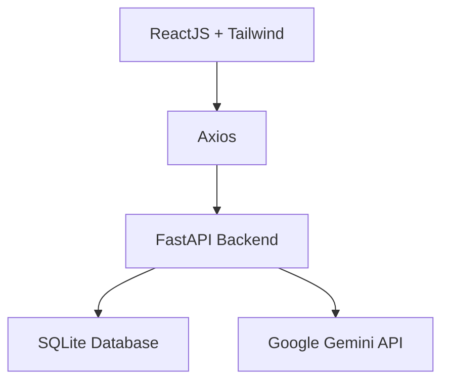

<div align="center">

# 📄 Resume Screening System

### ✨ AI-Powered Recruitment Platform (Google Gemini Integration)

<p>
Hệ thống web full-stack giúp tự động hóa quy trình tuyển dụng bằng AI,
phân tích CV và đánh giá mức độ phù hợp với Job Description (JD)
</p>


</div>

---

## 📌 Overview

**CV Filtering & Evaluation System** là nền tảng hỗ trợ tuyển dụng thông minh, sử dụng **AI (Google Gemini)** để:

🔹 Phân tích nội dung CV tự động
🔹 So khớp với Job Description (JD)
🔹 Đánh giá mức độ phù hợp bằng điểm số (%)
🔹 Tối ưu quy trình tuyển dụng cho HR

---

## ✨ Key Features

### 📄 CV Parsing (Trích xuất dữ liệu)

* Hỗ trợ file:

  * PDF, DOCX
* Tự động trích xuất:

  * 🧑‍💼 Thông tin cá nhân
  * 🎓 Học vấn
  * 💼 Kinh nghiệm
  * 🛠 Kỹ năng

---

### 🤖 AI Evaluation (Đánh giá thông minh)

* Sử dụng **Google Gemini API**
* Phân tích:

  * Mức độ phù hợp giữa CV & JD
* Kết quả:

  * 📊 Match Score (%)
  * 📝 Nhận xét chi tiết
  * 📌 Phân loại:

    * Đạt / Chờ xem xét / Không đạt

---

### 📊 Recruitment Dashboard

* Quản lý danh sách ứng viên
* Tìm kiếm & lọc:

  * Theo điểm số
  * Theo trạng thái
* Xem chi tiết hồ sơ

---

### ⚡ High Performance Processing

* Xử lý hàng loạt CV
* Tích hợp API cloud
* Tối ưu tốc độ phản hồi

---

## 🧱 Tech Stack

### 🔹 Architecture



---

### 🔹 Frontend

```text
React 18+
Tailwind CSS
Axios
```

---

### 🔹 Backend

```text
Python (FastAPI)
Uvicorn
Pydantic
Async Processing (Background Tasks)
```

---

### 🔹 Database

```text
SQLite (Lightweight, file-based DB)
```

---

### 🔹 AI Engine

```text
Google Gemini (gemini-1.5-flash / gemini-1.5-pro)
```

---

## 🚀 Getting Started

### ⚙️ Prerequisites

```bash
Node.js >= 18
Python >= 3.9
pip / virtualenv
SQLite (built-in)
Google AI Studio API Key
```

---

## 📥 Installation

### 1️⃣ Clone repository

```bash
git clone https://github.com/your-username/cv-filtering-gemini.git
cd cv-filtering-gemini
```

---

### 2️⃣ Backend Setup (FastAPI + SQLite)

```bash
cd backend

# Tạo môi trường ảo
python -m venv venv
source venv/bin/activate   # Linux/Mac
venv\Scripts\activate      # Windows

# Cài dependencies
pip install -r requirements.txt

# Tạo file env
cp .env.example .env

# Tạo database SQLite
touch database.db   # Linux/Mac
type nul > database.db   # Windows

# Run migration (nếu dùng Alembic)
alembic upgrade head

# Chạy server
uvicorn main:app --reload
```

---

### 3️⃣ Frontend Setup

```bash
cd frontend
npm install
npm run dev
```

## 🧠 AI Workflow

1. Upload CV
2. Parse nội dung
3. Gửi dữ liệu + JD → Gemini API
4. Nhận kết quả phân tích
5. Lưu SQLite DB & hiển thị Dashboard

---

## 🔐 Security

* Validate file upload
* Giới hạn request API
* Bảo mật API Key (.env)
* Backend kiểm soát truy cập

---

## 🤝 Contributing

```bash
git clone your-fork-url
npm install
pip install -r requirements.txt

npm run dev
uvicorn main:app --reload
```

---

## 📄 License

MIT License

---

## 👨‍💻 Contact

* 👤 Developer: **Đỗ Thành Nhân**
* 📧 Email: **[dothanhnhan1024@gmail.com](mailto:dothanhnhan1024@gmail.com)**
* 🌐 Demo: (update link nếu có)
* 📱 Hotline: +84 386 356 750

---

<div align="center">

⭐ **If this project helps you, give it a star!** ⭐

</div>
